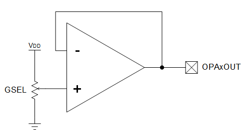
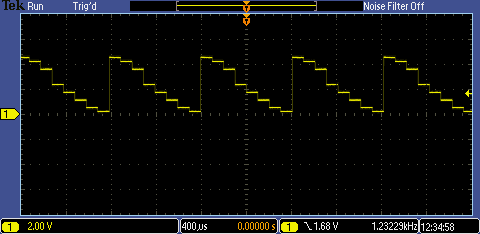

<!-- Please do not change this html logo with link -->

# Gain Ladder Demonstration for PIC18F16Q41
The operational amplifier (OPA) module on the PIC18-Q41 family of devices comes with an internal resistor ladder that can be used to set different gains internally. This code example demonstrates how to use the internal resistor ladder to generate various DC levels without the use of a DAC.

## Software Used
* <a href="http://www.microchip.com/mplab/mplab-x-ide">MPLAB® IDE 5.40 or newer</a>
* <a href="https://www.microchip.com/mplab/compilers">Microchip XC8 Compiler 2.20 or newer</a>
* <a href="https://www.microchip.com/mplab/mplab-code-configurator">MPLAB® Code Configurator (MCC) 3.95.0 or newer</a>

## Hardware Used
- <a href="https://www.microchip.com/wwwproducts/en/PIC18F16Q41">PIC18F16Q41 Product Information</a>
- <a href="https://www.microchip.com/DevelopmentTools/ProductDetails/PartNO/DM164137"> Microchip Curiosity Development Board (DM164137) - Rev 4 </a>

## Pin Table
| Pin | Function
| --- | --------
| RC2 | Output of the OPA module

## Operation 
The internal resistor ladder of the OPA module is normally used to provide feedback for the operational amplifier. In this code example, the internal resistor ladder is used to generate a voltage level based on the internal resistor ladder. The output of the operational amplifier is proportional to the resistor divider network created between Vdd and Vss, as shown below. GSEL (gain select) is the internal name for the resistor ladder.

 
*Internal Connections*

The table below (reproduced from the device datasheet) contains the ratios of the internal resistors available in PIC18F16Q41.

| Resistor Ratio   | Output %      | Ideal Output at Vdd = 5V
| ---------------- | ------------- | -------
| 1/15             | 6.25%         | 312.5mV
| 1/7              | 12.5%         | 625mV
| 1/3              | 25%           | 1.25V
| 1                | 50%           | 2.5V
| 5/3              | 62.5%         | 3.125V
| 3                | 75%           | 3.75V
| 7                | 87.5%         | 4.375V
| 15               | 93.75%        | 4.6875V

*Expected Outputs in the Gain Ladder*

To demonstrate the full range of outputs, the code example generates a free-running sawtooth waveform (shown below) that contains all of the output steps listed above. 

 
*Gain Ladder Output* 

## Summary
This code example demonstrates the internal resistor ladder to generate various DC output levels. The output levels can also be used to calculate the internal resistor ratios on the bench.
